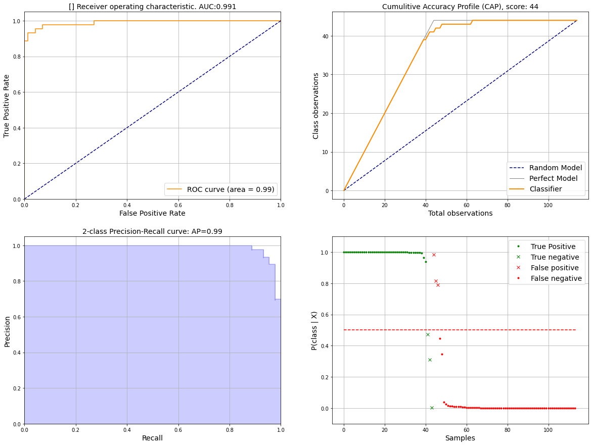
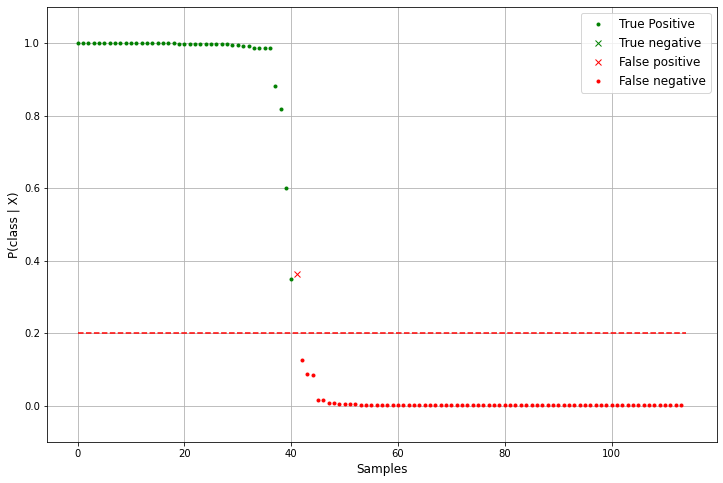

.. _code_directive:

-------------------------------------

Examples two-class model
'''''''''''''''''''''''''

In this example we are going to learn a model, and use the output `y_true`, `y_proba` and `y_pred` in ``classeval`` for the evaluation of the model.

.. code:: python

    # Import library
    import classeval as clf

    # Load example dataset
    X, y = clf.load_example('breast')
    X_train, X_test, y_train, y_true = train_test_split(X, y, test_size=0.2)

    # Train model
    model = gb.fit(X_train, y_train)
    y_proba = model.predict_proba(X_test)[:,1]
    y_pred = model.predict(X_test)

Now we can evaluate the model by:

.. code:: python

    # Evaluate
    out = clf.eval(y_true, y_proba, pos_label='malignant')

Print some results to screen:

.. code:: python

    # Print AUC score
    print(out['auc'])

    # Print f1-score
    print(out['f1'])

    # Show some results
    print(out['report'])
    # 
    # 		      precision    recall  f1-score   support
    # 
    # 	       False       0.96      0.96      0.96        70
    #           True       0.93      0.93      0.93        44
    # 
    # 	    accuracy                           0.95       114
    # 	   macro avg       0.94      0.94      0.94       114
    # 	weighted avg       0.95      0.95      0.95       114
	

Plot by using :func:`classeval.classeval.plot`:

Four subplots are created:
    * top left: ROC curve
    * top right: CAP curve
    * bottom left: AP curve
    * bottom right: Probability curve

.. code:: python

    # Make plot
    ax = clf.plot(out, figsize=(20,15), fontsize=14)

.. example1_fig1:

Class distribution in a bargraph

.. example1_fig3:

.. figure:: ../figs/example1_fig3.png

ROC in two-class
-------------------

Plot ROC using:

.. code:: python

    # Compute ROC
    out_ROC = clf.ROC.eval(y_true, y_proba, pos_label='malignant')

    # Make plot
    ax = clf.ROC.plot(out_ROC, title='Breast dataset')

Confmatrix in two-class
-------------------------

It is also possible to plot only the confusion matrix:

.. code:: python

    # Compute confmatrix
    out_CONFMAT = clf.confmatrix.eval(y_true, y_pred, normalize=True)

    # Make plot
    clf.confmatrix.plot(out_CONFMAT, fontsize=18)

.. example1_fig2:

.. figure:: ../figs/example1_fig2.png
    :scale: 50%

Examples multi-class model
''''''''''''''''''''''''''

In this example we are going to learn a **multi-class** model, and use the output `y_true`, `y_proba` and `y_pred` in ``classeval`` for the evaluation of the model.

.. code:: python

    # Import library
    import classeval as clf

    # Load example dataset
    X,y = clf.load_example('iris')
    X_train, X_test, y_train, y_true = train_test_split(X, y, test_size=0.5)

    # Train model
    model = gb.fit(X_train, y_train)
    y_pred = model.predict(X_test)
    y_proba = model.predict_proba(X_test)
    y_score = model.decision_function(X_test)

Lets evaluate the model results:

.. code:: python

    out = clf.eval(y_true, y_proba, y_score, y_pred)

Plot by using :func:`classeval.classeval.plot`

.. code:: python

    # Make plot
    ax = clf.plot(out)

.. multiclass_fig1_1:

.. figure:: ../figs/multiclass_fig1_1.png
    :scale: 80%

*Class distribution in a bargraph*

.. multiclass_fig1_3:

.. figure:: ../figs/multiclass_fig1_3.png

ROC in multi-class
--------------------

ROC uses the same function as for two-class.

.. code:: python

    # ROC evaluation
    out_ROC = clf.ROC.eval(y_true, y_proba, y_score)
    ax = clf.ROC.plot(out_ROC, title='Iris dataset')

Confmatrix in multi-class
---------------------------

Confmatrix uses the same function as for two-class.

.. code:: python

    # Confmatrix evaluation
    out_CONFMAT = clf.confmatrix.eval(y_true, y_pred, normalize=False)
    ax = clf.confmatrix.plot(out_CONFMAT)

Confusion matrix

.. multiclass_fig1_2:

.. figure:: ../figs/multiclass_fig1_2.png
    :scale: 50%

Normalized confusion matrix
----------------------------

.. code:: python

    # Confusion matrix
    out_CONFMAT = clf.confmatrix.eval(y_true, y_pred, normalize=True)
    # Plot
    ax = clf.confmatrix.plot(out_CONFMAT)

.. multiclass_fig1_4:

.. figure:: ../figs/multiclass_fig1_4.png
    :scale: 50%

Model Performance tweaking
'''''''''''''''''''''''''''''

It can be desired to tweak the performance of the model and thereby adjust, for example the number of False postives. With ``classeval`` it is easy to determine the most desired model.

Lets start with a simple model.

.. code:: python

    # Load example dataset
	X, y = clf.load_example('breast')
	X_train, X_test, y_train, y_true = train_test_split(X, y, test_size=0.2)

    # Fit model
	model = gb.fit(X_train, y_train)
	y_proba = model.predict_proba(X_test)[:,1]
	y_pred = model.predict(X_test)

The default threshold value is 0.5 and gives these results:

.. code:: python

	# Set threshold at 0.5 (default)
	out = clf.eval(y_true, y_proba, pos_label='malignant', threshold=0.5)

	# [[73  0]
	# [ 1 40]]

	# Make plot
	_ = clf.TPFP(out['y_true'], out['y_proba'], threshold=0.2, showfig=True, )

.. multiclass_threshold_05:

.. figure:: ../figs/multiclass_threshold_05.png
    :scale: 90%

Lets adjust the model by setting the threshold differently:

.. code:: python

	# Set threshold at 0.2
	out = clf.eval(y_true, y_proba, pos_label='malignant', threshold=0.2)

	# [[72  1]
	# [ 0 41]]

	# Make plot
	_ = clf.TPFP(out['y_true'], out['y_proba'], threshold=0.2, showfig=True, )

.. multiclass_threshold_02:

