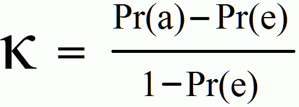

.. _code_directive:

-------------------------------------

Methods
'''''''''''

The ``classeval`` library contains various measures to estimate the models performance.
The main function to evaluated models performance is the function :func:`classeval.classeval.eval`. This function automatically determines whether your trained model is based on a **two-class** or **multi-class** approach. If desired, it is possible to directly use the two-class evalution method using :func:`classeval.classeval.eval_twoclass` and for multi-class: :func:`classeval.classeval.eval_multiclass`. 

Optimizing model performance
'''''''''''''''''''''''''''''''''

the ``classeval`` library can also help in tuning the models performance as the the threshold being used can be adjusted. After learning a model, and predicting new samples with it, each sample will get a probability belowing to the class. In case of our two-class approach the simple rule account: **P(class-of-interest) = 1-P(class-rest)**

Confusion matrix
''''''''''''''''

A confusion matrix is a table that is used to describe the performance of a classification model (or “classifier”) on a set of test data for which the true values are known. It is suitable for both **two-class** and **multi-class** approach.

Two-class evaluation
'''''''''''''''''''''''''''''''''

Two-class models are trained models whos results are based on two classes. The results can be derived from image-recognition, network-analysis, sensor data or any other type of data. The output of the model should result at least:

	* y_true : The true class label
	* y_pred : Predicted class label
	* y_proba : Probability of the predicted class label

With this information, various statistics can be performed that are described below:

ROC-AUC
--------

The Area Under The Curve (AUC) and Receiver Operating Characteristics curve (ROC) are one of the most important evaluation metrics for checking any classification model’s performance. The goal of the AUC-ROC is to determine the probability curve and degree or measure of separability by using various thresholds settings. It describes *how much* the model is capable of distinguishing between the classes. The higher the AUC, the better the model is at predicting whereas a AUC of 0.5 represents *random* results.

A perfect score would result in an AUC score=1 and ROC curve like this:

.. _ROC_best:

.. figure:: ../figs/ROC_best.png

The ROC plot with the AUC score can be evaluated by func:`classeval.ROC.eval` and the plot can be created with func:`classeval.ROC.plot`

.. code:: python

    # ROC evaluation
    out_ROC = clf.ROC.eval(y_true, y_proba, y_score)
    # Make plot
    ax = clf.ROC.plot(out_ROC)

CAP
----------------------

The CAP Curve analyse how to effectively identify all data points of a given class using minimum number of tries. This function computes Cumulitive Accuracy Profile (CAP) to measure the performance of a classifier. It ranks the predicted class probabilities (high to low), together with the true values. With that, it computes the cumsum which is the final line.
A perfect model is one which will detect all class 1.0 data points in the same number of tries as there are class 1.0 data points. This function is callable via: :func:`classeval.classeval.CAP`

Average Precision (AP)
----------------------

A better metric in an imbalanced situation is the AUC PR (Area Under the Curve Precision Recall), or also called AP (Average Precision). If the precision decreases when we increase the recall, it shows that we have to choose a prediction thresold adapted to our needs.
If our goal is to have a high recall, we should set a low prediction thresold that will allow us to detect most of the observations of the positive class, but with a low precision. On the contrary, if we want to be really confident about our predictions but don't mind about not finding all the positive observations, we should set a high thresold that will get us a high precision and a low recall. In order to know if our model performs better than another classifier, we can simply use the AP metric. To assess the quality of our model, we can compare it to a simple decision baseline. 

Let's take a random classifier as a baseline here that would predict half of the time 1 and half of the time 0 for the label. Such a classifier would have a precision of 4.3%, which corresponds to the proportion of positive observations. For every recall value the precision would stay the same, and this would lead us to an AP of 0.043. The AP of our model is approximately 0.35, which is more than 8 times higher than the AP of the random method. This means that our model has a good predictive power.

This function is callable via: :func:`classeval.classeval.AP`

F1-score
---------

The F1 score (also F-score or F-measure) is a measure of a test's accuracy. It considers both the precision p and the recall r of the test to compute the score: p is the number of correct positive results divided by the number of all positive results returned by the classifier, and r is the number of correct positive results divided by the number of all relevant samples (all samples that should have been identified as positive).

.. F1score:

.. figure:: ../figs/F1score.svg

Kappa
---------

In essence, the kappa statistic is a measure of how closely the instances classified by the machine learning classifier matched the data labeled as ground truth, controlling for the accuracy of a random classifier as measured by the expected accuracy.

In some other cases we might face a problem with imbalanced classes. E.g. we have two classes, say A and B, and A shows up on 5% of the time. Accuracy can be misleading, so we go for measures such as precision and recall. There are ways to combine the two, such as the F-measure, but the F-measure does not have a very good intuitive explanation, other than it being the harmonic mean of precision and recall.

*Cohen’s kappa statistic is a very good measure that can handle very well both multi-class and imbalanced class problems.*

.. cohen_kappa:

As an example, suppose we have the following results as depicted in the confusion matrix:

      +--------+-------+--------+
      |        |normal | defect |
      +--------+-------+--------+
      |	normal |  22   | 9      |
      +--------+-------+--------+
      |	defect |  7    | 13     |
      +--------+-------+--------+

    * Ground truth: normal (29), defect (22)
    * Machine Learning Classifier: normal (31), defect (20)
    * Total: (51)
    * Observed Accuracy: ((22 + 13) / 51) = 0.69
    * Expected Accuracy: ((29 * 31 / 51) + (22 * 20 / 51)) / 51 = 0.51
    * *Kappa*: (0.69 - 0.51) / (1 - 0.51) = 0.37

*Kappa values below 0 are possible, Cohen notes they are unlikely in practice.*

MCC
---------

*MCC is extremely good metric for the **imbalanced** classification.*

Score Ranges between [−1,1]:
	1 : Perfect prediction
	0 : Random prediction
	−1: Total disagreement between predicted scores and true labels values.

Multi-class evaluation
''''''''''''''''''''''

AUC multiclass
----------------------

Calculate the AUC using the One-vs-Rest scheme (OvR) and One-vs-One scheme (OvO) schemes.
The multi-class One-vs-One scheme compares every unique pairwise combination of classes. Macro average, and a prevalence-weighted average. This function is callable via: :func:`classeval.classeval.AUC_multiclass`

